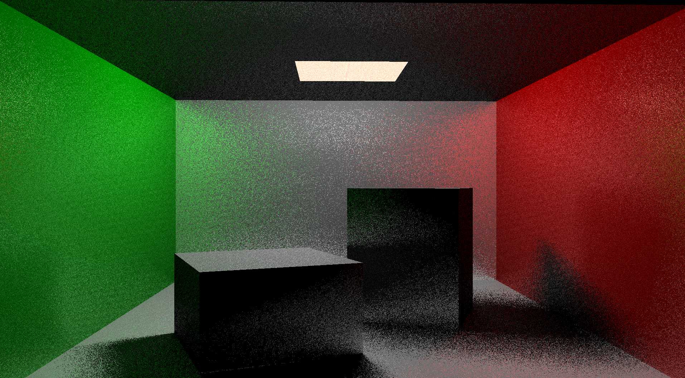

# 控制

w：上移摄像机
s：下移摄像机
a：左移摄像机
d：右移摄像机

数字键1：只有shadow ray

数字键2：shadow ray 、secondary ray、secondary shadow ray

滚轮：缩进
鼠标移动：左右扫视
esc：退出

## 只有shadow ray：

## secondary ray：

## raw glossy surface：

## denoised glossy surface(Reliable Motion vector)：

## denoised glossy surface(SVGF)：

